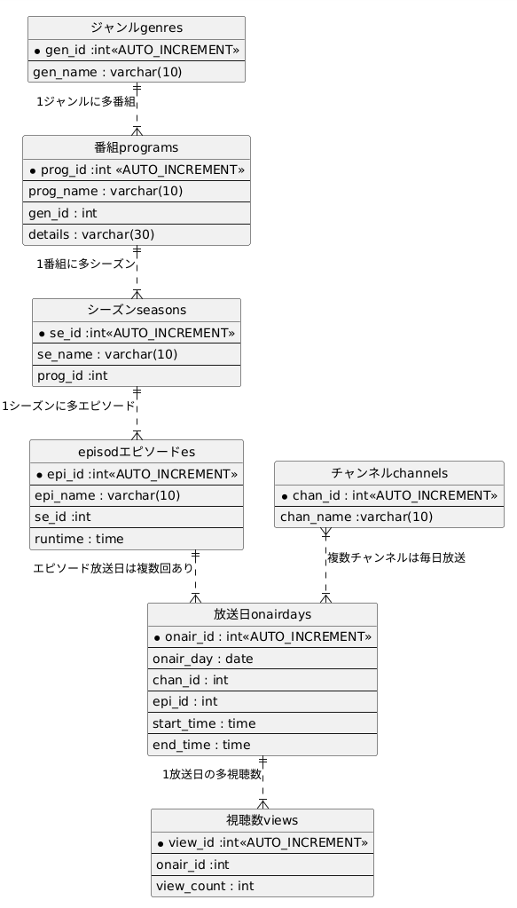

# テーブル設計

## ER図

## テーブル定義

|テーブル名|table name|
| ---- | ---- | 
| ジャンル| genres | 
|番組|programs|
|シーズン|seasons|
|エピソード|episodes|
|チャンネル|channels|
|放送日|onairdays|
|視聴数|views|

`ジャンル：genres`
|カラム名|データ型|NULL|キー|初期値|AUTO INCREMENT|
| ---- | ---- | ---- | ---- | ---- | ---- |
|gen_id|int||PRIMARY||YES|
|gen_name|varchar(10)|||||

`番組：programs`
|カラム名|データ型|NULL|キー|初期値|AUTO INCREMENT|
| ---- | ---- | ---- | ---- | ---- | ---- |
|pro_id|int||PRIMARY||YES|
|pro_name|varchar(30)|||||
|gen_id|int||INDEX|||
|derails|varchar(30)|YES||||

foreign key : (gen_id) references genres (gen_id)

`シーズン：seasons`
|カラム名|データ型|NULL|キー|初期値|AUTO INCREMENT|
| ---- | ---- | ---- | ---- | ---- | ---- |
|se_id|int||PRIMARY||YES|
|se_name|varchar(10)|YES||||
|prog_id|int||INDEX|||

foreign key：
(prog_id) references programs (prog_id)

`エピソード：episodes`
|カラム名|データ型|NULL|キー|初期値|AUTO INCREMENT|
| ---- | ---- | ---- | ---- | ---- | ---- |
|epi_id|int||PRIMARY||YES|
|epi_name|varchar(30)|YES||||
|se_id|int|||||
|runtime|time|||||

foreign key：
(se_id) references seasons (se_id)

`チャンネル：channels`
|カラム名|データ型|NULL|キー|初期値|AUTO INCREMENT|
| ---- | ---- | ---- | ---- | ---- | ---- |
|chan_id|int||PRIMARY||YES|
|chan_name|varchar(10)|||||

`放送日：onairdays`
|カラム名|データ型|NULL|キー|初期値|AUTO INCREMENT|
| ---- | ---- | ---- | ---- | ---- | ---- |
|onair_id|int||PRIMARY||YES|
|onair_day|date|||||
|chan_id|int||INDEX|||
|epi_id|int|||||
|start_time|time|||||
|end_time|time|||||

foreign key：

(chan_id) references channels (chan_id)  
(epi_id) references episodes (epi_id)  

`視聴数：views`
|カラム名|データ型|NULL|キー|初期値|AUTO INCREMENT|
| ---- | ---- | ---- | ---- | ---- | ---- |
|view_id|int||PRIMARY||YES|
|onair_id|int|||||
|view_count|int|||0||

foreign key：
(onair_id) references onairdays (onair_id)

ユニークキー制約 ：なし

